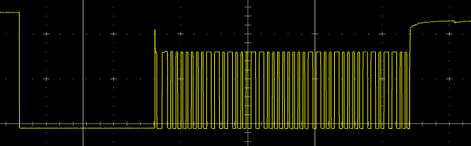
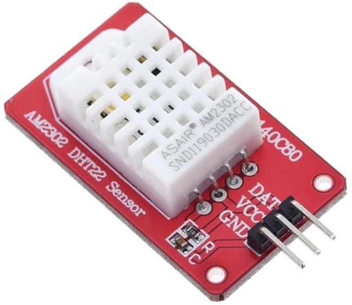

# DHT22
Arduino library for interface with DHT22 (AM2302) sensor, without use of pointers.

[datasheet](extras/DHT22-datasheet.pdf)

sample oscillogram :

sample module :

https://fr.aliexpress.com/wholesale?SearchText=DHT22
